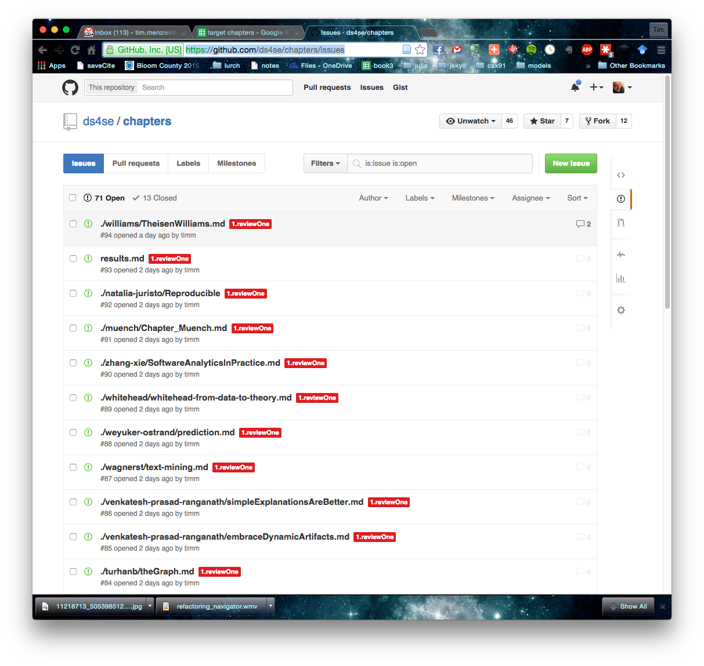
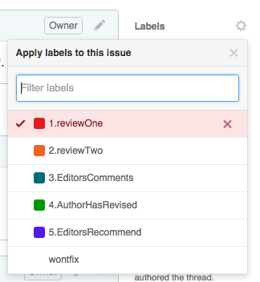

# Reviewer instructions

## Important dates

Unless you've made other arrangements with the editors, reviews are due Nov 23.

## BACKGROUND

For this book, we are experimenting with Github as a reviewing tool.

If you have problems using Github, then don’t use it.
Just email your review to your block editor and they will paste it in for you. 

IMPORTANT NOTE: In this tool, all reviewers can see all papers and all authors can see their reviewers. So in this review process, **politeness matters**. 

(Aside: why are we using Github? Cause Timm is worried about the increasing cost of editorial systems like Cyperchair and Easybhair and wants to explore $0 tools. Also, he is an old hippy  enamored with it and wants to experiment with open science, open source, open comment systems. Finally,  we could not talk him out of it.)

## BEFORE YOU START

Reviewers  have been divided into blocks of three.  To find your block,
please see [https://goo.gl/WLNUWs](https://goo.gl/WLNUWs)

Each block is managed by one of Laurie, Tim, or Tom. If you have any issues with the following instructions, please talk to your block manager (one of Tim, Tom or Laurie). Our emails are:

- tzimmer@microsoft.com" <tzimmer@microsoft.com>, 
- Laurie Williams <williams@csc.ncsu.edu>,
- tim menzies <tim.menzies@csc.ncsu.edu>

We did reviewer assignment randomly and manually so we need to check for COI issues. Please check your assignments (looking for COI). 

**Notes:**

1. If you have COI issues, contact your block manager.

2.  If you want to change your review assignment, please contact your block manager (but try not to swap to another block).

## How To Review

### Starting a review
Go to [https://github.com/ds4se/chapters/issues](https://github.com/ds4se/chapters/issues)

Find the issue report associated with your assigned
papers; e.g.  natalia juristo’s paper on
reproducibility is issue #92
 

Enter your review as a new comment on that
issues. To start a new review, go to the comments on
that issue and press the new issue button, top
right.

### Review template

To fill in your review please copy and paste in the following template, and fill in the “??” slots.

____
&lt;begin>

_(If you have confidential comments about this chapter, please email them to one of the book editors._)

<b>How would you categories the chapter: is it
1. SE-specific lessons (e.g. some  comments on issues that are specific to data science for software engineering)
2. Some general lessons about data analytics
3, Other (specify)  </b>

_??_

**On a scale of 1 to 7, nofun to fun, how fun is the chapter to read?**

_??_

**What is the core insight of the chapter?**

_written in one line or less_

**What is the chapter's  clear and approachable take away message?**

_??_

**Is the chapters   written for a generalist audience (no excessive use of technical terminology) with a minimum of diagrams and references?**

_??_

**Should the chapter be pruned (make it shorter)? If yes, how (e.g. (1) use less jargon, formula, diagrams, references; or (2) delete some section that does not work so well)**

_??_

**Can the chapter be longer? If yes, what else is needed?**

_??_

**If the chapter title a mantra; i.e. . some slogan reflecting best practice for data science for SE? If not, suggest a better title.**

_??_

**What are the best points of the chapter that the authors should  NOT _ change?**

_??_

**What are the weaker aspects of the chapter that authors  SHOULD  change?**

__??__
&lt;end>
______

### Finishing your review

Once your review is completed, relabel the issue. 

+ If this is the first review, relabel it to **2.reviewTwo**
+ It this is the second review, rebel it to **3.EditorsComment**

To rebel issues, click on the Labels menu (written in bold) and select from the following pop-up

